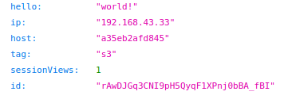
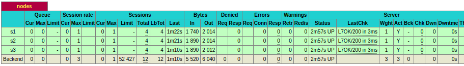
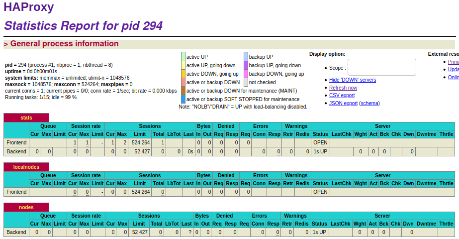
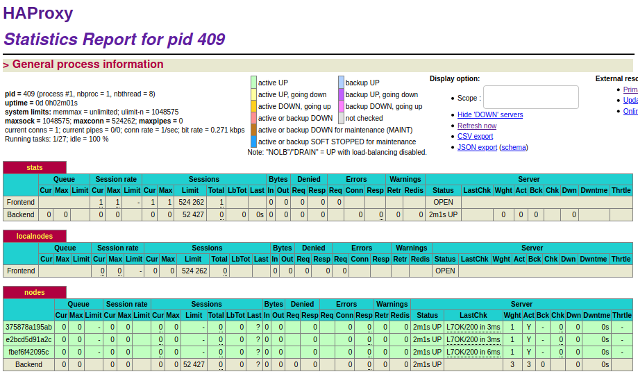
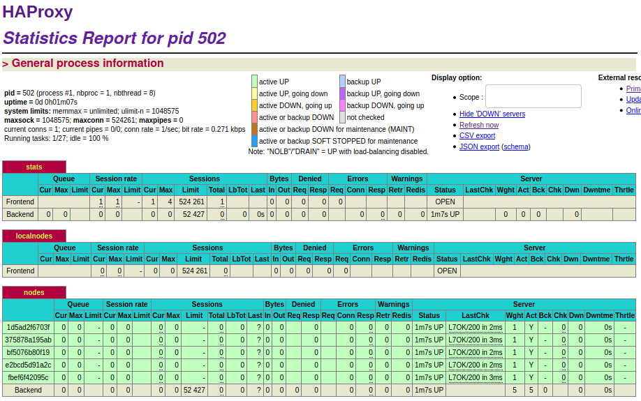
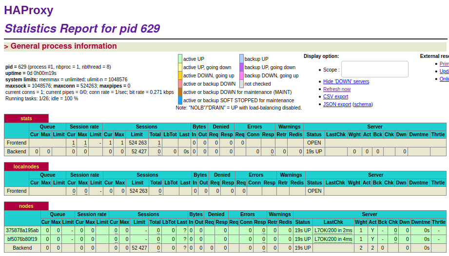

# AIT laboratoire 4 - Docker
`Auteurs: CANIPEL Vincent et SEMBLAT Clément`
Lien vers le dépôt: `https://github.com/petitRastignac/Teaching-HEIGVD-AIT-2020-Labo-Docker`

## <a name="introduction"></a> Introduction

Dans ce laboratoire nous allons nous concentrer sur une méthode pour rendre plus dynamique la mise en place de solution scalable. Le principe est de pouvoir appréhender les différents mécanismes de gestion de la virtualisation Docker afin d'en tirer le maximum mais aussi de pouvoir mettre en place des systèmes de gestion d'événements pour répondre aux imprévus et gérer en temps réel les configurations du Load Balancer.

Nous aborderons ces différents concepts au travers de l'utilisation de **Docker** pour la virtualisation, **HAProxy** comme Load Balancer, **Serf** comme système de communication dit de 'potins' (gossip) et **S6** comme superviseur de processus.

## <a name="tableofcontent"></a> Table des matières

**[Introduction](#introduction)**

**[Table des matières](#tableofcontent)**

**[Chapitre 0: Identification des problèmes et installation des outils](#C0)**

&ensp;&ensp;&ensp;&ensp;[Identification des problèmes](#C0-pb)

&ensp;&ensp;&ensp;&ensp;&ensp;&ensp;&ensp;&ensp;[M1](#C0-M1)&ensp;[M2](#C0-M2)&ensp;[M3](#C0-M3)&ensp;[M4](#C0-M4)&ensp;[M5](#C0-M5)&ensp;[M6](#C0-M6)

&ensp;&ensp;&ensp;&ensp;[Installation des outils](#C0-pb)

&ensp;&ensp;&ensp;&ensp;&ensp;&ensp;&ensp;&ensp;[Réponses:](#C0-rep)
&ensp;&ensp;&ensp;&ensp;&ensp;&ensp;&ensp;&ensp;[Question 1](#C0-q1)
&ensp;&ensp;&ensp;&ensp;&ensp;&ensp;&ensp;&ensp;[Question 2](#C0-q2)

**[Chapitre 1: Ajouter un superviseur de processus pour faire tourner plusieurs processus](#C1)**

&ensp;&ensp;&ensp;&ensp;&ensp;&ensp;&ensp;&ensp;[Réponses:](#C1-rep)
&ensp;&ensp;&ensp;&ensp;&ensp;&ensp;&ensp;&ensp;[Question 1](#C1-q1)
&ensp;&ensp;&ensp;&ensp;&ensp;&ensp;&ensp;&ensp;[Question 2](#C1-q2)

**[Chapitre 2: Ajout d'un outil pour gérer l'appartenance au cluster des serveurs WEB](#C2)**

&ensp;&ensp;&ensp;&ensp;&ensp;&ensp;&ensp;&ensp;[Réponses:](#C2-rep)
&ensp;&ensp;&ensp;&ensp;&ensp;&ensp;&ensp;&ensp;[Question 1](#C2-q1)
&ensp;&ensp;&ensp;&ensp;&ensp;&ensp;&ensp;&ensp;[Question 2](#C2-q2)
&ensp;&ensp;&ensp;&ensp;&ensp;&ensp;&ensp;&ensp;[Question 3](#C2-q3)

**[Chapitre 3: Réagir au changement dans la liste des membres](#C3)**

&ensp;&ensp;&ensp;&ensp;&ensp;&ensp;&ensp;&ensp;[Réponses:](#C3-rep)
&ensp;&ensp;&ensp;&ensp;&ensp;&ensp;&ensp;&ensp;[Question 1](#C3-q1)
&ensp;&ensp;&ensp;&ensp;&ensp;&ensp;&ensp;&ensp;[Question 2](#C3-q2)

**[Chapitre 4: Utilisation d'un moteur de template pour facilement générer des fichiers de configuration](#C4)**

&ensp;&ensp;&ensp;&ensp;&ensp;&ensp;&ensp;&ensp;[Réponses:](#C4-rep)
&ensp;&ensp;&ensp;&ensp;&ensp;&ensp;&ensp;&ensp;[Question 1](#C4-q1)
&ensp;&ensp;&ensp;&ensp;&ensp;&ensp;&ensp;&ensp;[Question 2](#C4-q2)
&ensp;&ensp;&ensp;&ensp;&ensp;&ensp;&ensp;&ensp;[Question 3](#C4-q3)
&ensp;&ensp;&ensp;&ensp;&ensp;&ensp;&ensp;&ensp;[Question 4](#C4-q4)

**[Chapitre 5: Générer une nouvelle configuration de load balancer quand la liste des membres changent](#C5)**

&ensp;&ensp;&ensp;&ensp;&ensp;&ensp;&ensp;&ensp;[Réponses:](#C5-rep)
&ensp;&ensp;&ensp;&ensp;&ensp;&ensp;&ensp;&ensp;[Question 1](#C5-q1)
&ensp;&ensp;&ensp;&ensp;&ensp;&ensp;&ensp;&ensp;[Question 2](#C5-q2)
&ensp;&ensp;&ensp;&ensp;&ensp;&ensp;&ensp;&ensp;[Question 3](#C5-q3)
&ensp;&ensp;&ensp;&ensp;&ensp;&ensp;&ensp;&ensp;[Question 4](#C5-q4)

**[Chapitre 6: Faire recharger automatiquement sa nouvelle configuration au Load Balancer](#C6)**

&ensp;&ensp;&ensp;&ensp;&ensp;&ensp;&ensp;&ensp;[Réponses:](#C6-rep)
&ensp;&ensp;&ensp;&ensp;&ensp;&ensp;&ensp;&ensp;[Question 1](#C6-q1)
&ensp;&ensp;&ensp;&ensp;&ensp;&ensp;&ensp;&ensp;[Question 2](#C6-q2)
&ensp;&ensp;&ensp;&ensp;&ensp;&ensp;&ensp;&ensp;[Question 3](#C6-q3)

**[Difficultés](#diff)**

**[Conclusion](#conclusion)**

##  <a name="C0"></a> Chapitre 0: Identification des problèmes et installation des outils

### <a name="C0-pb"></a> Identification des problèmes

On veut être capable d'ajouter ou de supprimer dynamiquement des serveurs sur notre système pour prendre en charge une potentielle augmentation de trafic.

Tout cela dans un contexte dans lequel à cause d'un bogue non découvert les serveurs peuvent crash de manière non prédictible.

On reprend le système que nous avons mis en place dans le laboratoire différent pour répondre aux questions:

#### <a name="C0-M1"></a> [M1]

Il n'est pas possible d'utiliser la solution actuelle dans le cadre d'un environnement de production car celle-ci est trop instable.

Une telle solution dans un environnement de production possède les problèmes suivants:
- Un nombre fixe de serveur qui induit qu'en cas de flux trop important, on ne peut pas rapidement ajouter des serveurs pour partager la charge. L'expérience utilisateur sera donc moins bonne à cause des ralentissements et autres problèmes liés à la surcharge.
- Un nombre fixe de serveur qui induit aussi qu'en cas d'erreurs et de crash sur un serveur, on ne puisse pas le retirer et le remplacé facilement par un autre. 

#### <a name="C0-M2"></a> [M2]

Pour ajouter une nouvelle webapp à l'infrastructure, c'est-à-dire un nœud s3 par exemple, il faudrait:
- On commence par ajouter des variables d'environnement dans le fichier `.env` pour notre nouveau nœud:
```
WEBAPP_3_NAME=s3
WEBAPP_3_IP=192.168.43.33 # modification de toutes les ip de 192.168.42.** à 192.168.43.** car la première adresse était déjà occupé
```
- Ensuite, il faut modifier le `docker-compose.yml` afin de permettre la création d'un conteneur **s3** supplémentaire pour l'image webapp:
```
  webapp3:
       container_name: ${WEBAPP_3_NAME}
       build:
         context: ./webapp
         dockerfile: Dockerfile
       networks:
         public_net:
           ipv4_address: ${WEBAPP_3_IP}
       ports:
         - "4002:3000"
       environment:
            - TAG=${WEBAPP_3_NAME}
            - SERVER_IP=${WEBAPP_3_IP}
```
- Puis ajouter dans le `docker-compose.yml`, la variable d'environnement pour le nœud s3 pour le conteneur **HAProxy**:
```
       environment:
            - WEBAPP_1_IP=${WEBAPP_1_IP}
            - WEBAPP_2_IP=${WEBAPP_2_IP}
            - WEBAPP_3_IP=${WEBAPP_3_IP}
```
- On modifie les configurations de **HAProxy** en commençant par le fichier de configuration `haproxy.cfg`:
```
    server s1 ${WEBAPP_1_IP}:3000 check cookie s1 
    server s2 ${WEBAPP_2_IP}:3000 check cookie s2 
    # Ajout du serveur 3
    server s3 ${WEBAPP_3_IP}:3000 check cookie s3
```
- On modifie les scripts de **HAProxy** en ajoutant (exemple pour `run.sh`):
```
sed -i 's/<s1>/$S1_PORT_3000_TCP_ADDR/g' /usr/local/etc/haproxy/haproxy.cfg
sed -i 's/<s2>/$S2_PORT_3000_TCP_ADDR/g' /usr/local/etc/haproxy/haproxy.cfg
# On ajoute pour s3
sed -i 's/<s3>/$S3_PORT_3000_TCP_ADDR/g' /usr/local/etc/haproxy/haproxy.cfg
```
- Puis on reconstruit le tout avec l'aide de la commande:
```
docker-compose up --build
```
Au bout de ces étapes, on retrouve bien le nœud s3 supplémentaire dans la solution du td précédent:

 

#### <a name="C0-M3"></a> [M3]

Comme nous avons pu le voir dans la question précédente l'ajout d'un nouveau nœud est long et nécessite des modifications sur plusieurs fichiers. De plus, il faut redémarrer toutes les configurations en reconstruisant les images Docker, ce qui peut être très long et empêcher le fonctionnement du load balancer pendant cette période.

Il faudrait alors être capable de pouvoir ajouter et supprimer des conteneurs **webapp** et leurs configurations dans le **HAProxy** sans redémarrer toute l'infrastructure.

On pourrait:
- Définir dynamiquement pour chaque conteneur une adresse ip.
- Être capable de communiquer cette adresse ip à la configuration de **HAProxy**.
- Être capable de recharger la configuration de **HAProxy** sans éteindre le load balancer pour l'adapter à la nouvelle liste de nœud.
- Être capable de communiquer les différents événements sur les différents serveurs **webapp** pour en cas de crash par exemple prévenir et changer la configuration du load balancer.

#### <a name="C0-M4"></a> [M4] 

La liste des nœuds dans la configuration de **HAProxy** est codé en dur. Afin de gérer de façon plus dynamique les nœuds du load balancer, on pourrait modifier le fichier de configuration lors d'événements déclencheurs sur nos **webapp** et recharger ces configurations après pour que le load balancer s'adapte.

#### <a name="C0-M5"></a> [M5] 

La solution actuelle n'est pas assez flexible pour permettre de push les logs des différentes machines. En effet, les conteneurs Docker ne font tourner qu'un processus, qui est ici la **webapp**. Il faudrait dès lors que le processus de la **webapp** s'en occupe ce qui n'est pas du tout son rôle.

La réponse est alors **non**. Ce qu'il manque est d'un moyen de faire tourner plusieurs processus en simultané dans nos conteneurs. Pour cela nous pouvons utiliser un gestionnaire de processus comme **supervisord**.

#### <a name="C0-M6"></a> [M6] 

Dans la situation d'un script `run.sh` qui remplace des lignes de notre configuration avant de lancer **HAProxy** nous ne sommes pas du tout dans un système dynamique.

En effet, si l'on ajoute un serveur, il faut alors modifier le script `run.sh` avant que **HAProxy** et le script ne soit lancé. Ce qui n'a alors rien de dynamique car on a une configuration statique lorsque **HAProxy** est en fonctionnement.

Pour résoudre ce problème du manque de dynamisme, il faudrait pouvoir **modifier** les configurations de **HAProxy** pendant son fonctionnement et alors **relancer HAProxy** (mauvaise méthode qui peut provoquer des problèmes pour les utilisateurs) ou faire **recharger ses configurations à HAProxy** lorsque celles-ci sont modifiées.

### <a name="C0-outils"></a> Installation des outils

On commence par installer le projet avec la commande:
`docker-compose up --build`
Ensuite, nous pouvons vérifier que les 3 conteneurs soient bien en marche:
```
CONTAINER ID        IMAGE                                          COMMAND                  CREATED             STATUS              PORTS                                                                NAMES
b253ff9a07c6        teaching-heigvd-ait-2020-labo-docker_webapp1   "docker-entrypoint.s…"   57 seconds ago      Up 56 seconds       0.0.0.0:4000->3000/tcp                                               s1
cb7f7c98f379        teaching-heigvd-ait-2020-labo-docker_webapp2   "docker-entrypoint.s…"   57 seconds ago      Up 56 seconds       0.0.0.0:4001->3000/tcp                                               s2
6b4c77010e07        teaching-heigvd-ait-2020-labo-docker_haproxy   "/docker-entrypoint.…"   57 seconds ago      Up 57 seconds       0.0.0.0:80->80/tcp, 0.0.0.0:1936->1936/tcp, 0.0.0.0:9999->9999/tcp   ha
```
Maintenant, nous vérifions le réseaux heig:
```
NETWORK ID          NAME                DRIVER              SCOPE
3b551039746f        bridge              bridge              local
ce4a0057725e        heig                bridge              local
84becfc0f45a        host                host                local
1e37a6d822d3        none                null                local
```

------------
### <a name="C0-rep"></a> RÉPONSES

#### <a name="C0-q1">Question 1
Nous pouvons nous connecter sur l'adresse suivante http://192.168.42.42:1936 :


#### <a name="C0-q2"></a>Question 2
Lien vers le répertoire du laboratoire: https://github.com/petitRastignac/Teaching-HEIGVD-AIT-2020-Labo-Docker

## <a name="C1"></a> Chapitre 1: Ajouter un superviseur de processus pour faire tourner plusieurs processus

Docker est une technologie qui a été mise en place avec l'esprit suivant: un conteneur, un processus. Dès lors, dès qu'un processus se termine son conteneur va s'arrêter. Afin d'éviter cette situation nous allons utiliser un superviseur de processus: S6.

On remplace le `TODO: [S6] Install` dans la docker image de **HAProxy** et de **l'application WEB**.

- Pour **HAProxy** et **l'application WEB**:
    ```
    # TODO: [S6] Install
    # Download and install S6 overlay
    RUN curl -sSLo /tmp/s6.tar.gz https://github.com/just-containers/s6-overlay/releases/download/v2.1.0.2/s6-overlay-amd64.tar.gz \
    && tar xzf /tmp/s6.tar.gz -C / \
    && rm -f /tmp/s6.tar.gz
    ```
On modifie le `LABEL` par notre nom et email:

- Pour **HAProxy** et **l'application WEB**:
    ```
    # TODO: [GEN] Replace with your name and email
    LABEL Vincent Canipel <vincent.canipel@heig-vd.ch>
    ```

On configure S6 comme le principal processus sur les deux images:

- Pour **HAProxy** et **l'application WEB**:
    ```
    # TODO: [S6] Replace the following instruction
    # This will start S6 as our main process in our container
    ENTRYPOINT ["/init"]
    ```

Si on construit et on fait tourner les images, on n'obtient rien:
```
s1         | [services.d] done.
s2         | [services.d] done.
ha         | [services.d] done.
```

Il faut mettre en place les **scripts** pour faire fonctionner correctement notre superviseur, ainsi on commence par créer les dossiers **/services/ha** et **/services/node**:
```
mkdir -p ha/services/ha webapp/services/node
```
Puis on copie les fichiers **run.sh** dans ces nouveaux fichiers:
```
cp cp ./ha/scripts/run.sh ./ha/services/ha/run && chmod +x ./ha/services/ha/run
cp /webapp/scripts/run.sh /webapp/services/node/run && chmod +x /webapp/services/node/run
```
Puis on remplace `#!/bin/sh` par `#!/usr/bin/with-contenv bash` dans les deux fichiers run.

Finalement, on modifie de nouveau les deux Dockerfiles:
- Pour **HAProxy**:
```
# TODO: [S6] Replace the two following instructions
# Copy the S6 service and make the run script executable
COPY services/ha /etc/services.d/ha
RUN chmod +x /etc/services.d/ha/run
``` 
- Pour **application WEB**:
```
# TODO: [S6] Replace the two following instructions
# Copy the S6 service and make the run script executable
COPY services/node /etc/services.d/node
RUN chmod +x /etc/services.d/node/run
```

------------
### <a name="C1-rep"></a> RÉPONSES

#### <a name="C1-q1"> Question 1
Après toutes les modifications précédentes, on reprend une capture d'écran du tableau de bord à l'adresse: http://192.168.42.42:1936.


#### <a name="C1-q2"></a> Question 2 
Cette tâche a pour but de modifier le comportement originel du système de docker qui est basiquement: un processus pour un conteneur. La configuration est assez difficile car elle demande d'imbriquer plusieurs éléments avec le superviseur S6.

Cette installation consiste alors à remplacer le mode de lancement normal d'un conteneur en passant avec un superviseur qui utilisera son propre script de fonctionnement pour gérer les processus du conteneur dans lequel il est installé.

On installe ce genre de processus pour éviter que les conteneurs, en cas de crash s'éteignent complètement et nécessitent alors d'être totalement relancés. En effet, les superviseurs offrent un plus grand champ d'action dans la gestion des processus comme pouvoir:
    - Relancer un processus en cas de crash
    - Relancer un groupe de processus en cas de problème
    - Faciliter le lancement des différents processus
    - Utiliser plusieurs processus qui ont besoin d'une certaine coordination

## <a name="C2"></a> Chapitre 2: Ajout d'un outil pour gérer l'appartenance au cluster des serveurs WEB

Le but de cette partie est de rendre l'infrastructure plus flexible pour pouvoir ajouter ou supprimer dynamiquement des serveurs web. Pour cela nous allons utiliser **serf** qui va nous permettre de faire communiquer les agents entre eux par **un système peer-to-peer décentralisé**.

Le but à atteindre sera alors:
- De pouvoir lancer le load balancer **HAProxy** aussi longtemps que possible
- Démarrer un ou plusieurs nœuds en backend à n'importe quel moment quand le load balancer est lancé
- Faire en sorte que le load balancer ait les informations sur les nœuds qui apparaissent et disparaissent et qu'il soit capable de réagir aux différents événements qui peuvent survenir.

On commence par installer **Serf**, pour cela nous modifions les Dockerfiles de **HAProxy** et de **l'application WEB**:

```
# TODO: [Serf] Install
# Install serf (for decentralized cluster membership: https://www.serf.io/)
RUN mkdir /opt/bin \
    && curl -sSLo /tmp/serf.gz https://releases.hashicorp.com/serf/0.8.2/serf_0.8.2_linux_amd64.zip \
    && gunzip -c /tmp/serf.gz > /opt/bin/serf \
    && chmod 755 /opt/bin/serf \
    && rm -f /tmp/serf.gz
```

Maintenant, il convient de faire les configurations sur notre superviseur pour l'utilisation du service **Serf**. On crée un fichier dédié pour **HAProxy** et **l'application WEB**:
```
mkdir ./ha/services/serf ./webapp/services/serf
```

Puis, on y ajoute des exécutables `run`:
```
touch /ha/services/serf/run && chmod +x /ha/services/serf/run
touch ./webapp/services/serf/run && chmod +x ./webapp/services/serf/run
```

On utilise le code du répertoire pour ces exécutables.

Après la création des deux scripts, on se doit de les prendre en compte dans les Dockerfiles. Ainsi, on ajoute aux deux:
```
COPY services/serf /etc/services.d/serf
RUN chmod +x /etc/services.d/serf/run
```
Et on expose les ports pour la communication avec **Serf**:
```
# TODO: [Serf] Expose ports
# Expose the ports for Serf
EXPOSE 7946 7373
```

On vérifie si tous fonctionnent maintenant. On reconstruit les images. Puis on nettoie les dossiers et fichiers inutiles avec les commandes:
```
rm /ha/scripts/run.sh
rm -r /webapp/scripts
```

------------
### <a name="C2-rep"></a> RÉPONSES

#### <a name="C2-q1"></a> Question 1

On cherche à récupérer les logs de nos conteneurs. On commence par lancer le conteneur **ha** avec la commande suivante:
```
docker run -d -p 80:80 -p 1936:1936 -p 9999:9999 --network heig --link s1 --link s2 --name ha haproxy
```
Puis les conteneurs **s1** et **s2** avec les commandes:
```
docker run -d --network heig --name s1 webapp
docker run -d --network heig --name s2 webapp
```
Les logs de cette étape sont dans le fichier `/logs/task2`

#### <a name="C2-q2"></a> Question 2 

Le problème que les nœuds soient codés en dure dans les configurations peut s'adresser avec une solution comme **Serf**. En effet, **Serf** permet de rendre plus flexible la gestion des nœuds en les rendant dynamiques.

C'est à travers son système de communication que **Serf** va permettre aux serveurs d'applications de communiquer avec le load balancer pour pouvoir le 'reconfigurer' avec leurs apparitions et disparitions.

**Serf** peut maintenir une liste de membres par exemple des nœuds et lorsque l'un d'entre eux est en échec, **Serf** peut communiquer avec les autres membres et le load balancer pour l'avertir de l'événement et modifier ses configurations.

#### <a name="C2-q3"></a> Question 3 

**Serf** fonctionne grâce à l'utilisation de **Serf agent**. Chaque nœud doit posséder un **Serf agent** afin de pouvoir récupérer ses informations, gérer des potentiels événements, détecter des crashs... Ceux sont ces **Serf agents** qui définissent ensemble un **Serf cluster**.

Les fonctionnalités de **Serf** fonctionnent grâce au **GOSSIP protocol** qui permet une communication rapide entre les différents agents d'un même cluster. Le **GOSSIP protocol** fonctionne en utilisant UDP et est basé sur **"SWIM: Scalable Weakly-consistent infection-style Process Group Membership Protocol"**. Par exemple, afin de pouvoir détecter l'inactivité d'un nœud **Serf** passe par le protocole **GOSSIP** qui va envoyer de manière périodique et aléatoirement des vérifications. Si un nœud ne répond pas à la vérification, il sera noté suspicieux par tous les nœuds du cluster (par propagation). Si le nœud suspicieux ne lève pas les suspicions, il sera considéré comme éteint et sortira du cluster.

## <a name="C3"></a> Chapitre 3: Réagir au changement dans la liste des membres

Nous allons ajouter des scripts pour que **Serf** puisse gérer quand un membre quitter où rejoint la liste des membres.

```
touch ./ha/scripts/member-join.sh && chmod +x ./ha/scripts/member-join.sh
touch ./ha/scripts/member-leave.sh && chmod +x ./ha/scripts/member-leave.sh
```

Puis maintenant on copie les scripts du répertoire git pour **member-join.sh** et **member-leave.sh**.

Puis on modifie l'image Docker de **HAProxy** pour faire en sorte que le conteneur puisse les utiliser:

```
# TODO: [Serf] Copy events handler scripts
COPY scripts /serf-handlers
RUN chmod +x /serf-handlers/member-join.sh
RUN chmod +x /serf-handlers/member-leave.sh
```

Maintenant, nous reconstruisons l'image pour **HAProxy** et nous lançons la commande suivante **(On récupère les logs)**:

```
docker run -d -p 80:80 -p 1936:1936 -p 9999:9999 --network heig --name ha haproxy
```

Puis, on lance un des deux backend conteneurs **(On récupère les logs puis rapidement encore ceux de ha)**:

```
docker run -d --network heig --name s1 webapp
docker run -d --network heig --name s2 webapp
```

Maintenant, nous allons récupérer les logs dans le fichier serf.log dans le conteneur de **HAProxy** avec les commandes suivantes:

```
docker exec -ti ha /bin/bash
```
```
cat /var/log/serf.log
```

------------
### <a name="C3-rep"></a> RÉPONSES

#### <a name="C3-q1">Question 1

Les logs sont disponibles dans le répertoire dans le dossier `/logs/task3`:
- `haSEUL` représente les logs de **ha** quand il est le seul conteneur a être lancé.
- `s1` représente les logs de **s1** quand il est lancé après **ha**
- `haAPRESs1` représente les logs de **ha** après le lancement de **s1**, on remarque que le script `member-join.sh` est lancé par l'apparition du nœud de **s1**.

#### <a name="C3-q2">Question 2

Les logs sont disponibles dans le répertoire dans le dossier `/logs/task3` sous le nom de `serf`.

## <a name="C4"></a> Chapitre 4: Utilisation d'un moteur de template pour facilement générer des fichiers de configuration

Pour la mise en place du moteur de template nous allons utiliser **NodeJS** et **Handlebars**.

On configure alors le Dockerfile de **HAProxy** pour ajouter l'installation de **NodeJS**:

```
# TODO: [HB] Install NodeJS
# Install NodeJS
RUN curl -sSLo /tmp/node.tar.xz https://nodejs.org/dist/v14.15.1/node-v14.15.1-linux-x64.tar.xz \
  && tar -C /usr/local --strip-components 1 -xf /tmp/node.tar.xz \
  && rm -f /tmp/node.tar.xz
```

Pour cela on doit ajouter l'installation de `xz-utils`:

```
# Install some tools
# TODO: [HB] Update to install required tool to install NodeJS
RUN apt-get update && apt-get -y install wget curl vim iputils-ping rsyslog xz-utils
```

Puis on installe **Handlebars**:

```
# TODO: [HB] Install Handlebars
# Install the handlebars-cmd node module and its dependencies
RUN npm install -g handlebars-cmd
```

Maintenant nous allons mettre à jour le **handler script** pour utiliser **Handlebars**. Alors, on crée le fichier `haproxy.cfg.hb` dans le dossier `ha/config`, on utilise la commande suivante:

```
echo "Container {{ name }} has joined the Serf cluster with the following IP address: {{ ip }}" >> /ha/config/haproxy.cfg.hb
```

Puis on modifie le Dockerfile pour récupérer ce fichier dans les futurs conteneurs:

```
# TODO: [HB] Copy the haproxy configuration template
RUN mkdir /config
COPY config/haproxy.cfg.hb /config
```

On met à jour notre script `member-join.sh` avec le modèle fournit dans le répertoire github.

Et maintenant, on reconstruit l'image de **HAProxy**. Puis on lance le conteneur et avec les commandes:

```
docker exec -ti ha /bin/bash
cat /tmp/haproxy.cfg
```

On récupère les logs que l'on met dans le fichier `/logs/task4` avec pour nom `haproxycfg1`.

On va faire un test end-to-end pour vérifier que tout fonctionne. Alors on va allumer les conteneurs **s1** et **s2** et vérifier les modifications dans les configurations dans le conteneur **ha**.

- On allume avec la commande `docker run -d --network heig --name s1 webapp`, le conteneur s1. Puis on vérifie dans le conteneur **ha**, les modifications de configurations (fichier `haproxycfgS1` dans le dossier `/logs/task4`).

- On fait de même avec **s2** (fichier `haproxycfgS2` dans le dossier `/logs/task4`).

------------
### <a name="C4-rep"></a> RÉPONSES

#### <a name="C4-q1"></a> Question 1 

Quand nous avons ajouté `xz-utils` nous avons dû reconstruire toute l'image. Une bonne pratique dans la création d'image Docker est de structurer l'image de telle sorte à ce que le cache soit le plus réutilisable possible. Alors il faudrait pour éviter le problème d'une reconstruction plus longue et non optimisé de l'image: ordonner les couches de la moins fréquemment changé à la plus fréquemment changé.

Les avantages et inconvénients à la fusion du plus possible de commande sont:
- Avantages:
    - Les instructions `RUN`, `COPY`, `ADD` créent des couches dans l'image Docker cependant il faut minimiser les couches. La fusion de commande permet de limiter le nombre de couche et donc la taille des images.
    - L'écriture de plusieurs commandes en une comme dans l'exemple donné sur les meilleurs pratiques de Docker:
    ```
    RUN apt-get update && apt-get install -y \
        bzr \
        cvs \
        git \
        mercurial \
        subversion \
        && rm -rf /var/lib/apt/lists/*
    ```
    permet d'éviter la duplication de paquets, de rendre la liste plus facile à mettre à jour.
- Inconvénients:
    - Cela peut rendre la compréhension et la relecture de l'image compliquée
    - La séparation des couches ne peut pas être utilisée pour séparer les installations et éviter les superpositions

Quelques articles soulèvent les questions de `flattening` ou `squashing` des images. Ces méthodes consistent à réduire la taille des images en réduisant le nombre de couches pour une image, en optimisant sa création et en se débarrassant des éléments utilisés lors de la création de l'image et inutile après. Docker permet l'utilisation du drapeau `--squash` pour automatiser ce processus. En voici quelques uns:
- https://labs.sogeti.com/slim-docker-images/
- https://stackoverflow.com/questions/22713551/how-to-flatten-a-docker-image
- http://jasonwilder.com/blog/2014/08/19/squashing-docker-images/

#### <a name="C4-q2"></a> Question 2 

Améliorer l'architecture de nos images pourrait passer par l'utilisation du concept de multi-stage builds. Cela consisterait à utiliser plusieurs instructions `FROM` dans nos Dockerfiles pour bien séparer les différents éléments et optimiser la création de nos images (réduction du nombre de couches dans nos images). Par exemple, pour l'image de **HAProxy**:
- Une instruction `FROM` pour **HAProxy** avec ensuite ses instructions propres,
- Une instruction `FROM` pour **NodeJS** avec ensuite ses instructions propres,
- Une instruction `FROM` pour **Serf** avec ensuite ses instructions propres ...

#### <a name="C4-q3">Question 3

Dans le fichier `/logs/task4`, il y a 7 fichiers:
3 premiers fichiers de logs de `/tmp/haproxy.cfg`:
- `haproxycfg1`, la configuration de la première étape, c'est-à-dire le lancement du conteneur **ha**.
- `haproxycfgS1`, la configuration de la deuxième étape, c'est-à-dire le lancement du conteneur **s1**.
- `haproxycfgS2`, la configuration de la troisième étape, c'est-à-dire le lancement du conteneur **s2**.
4 fichiers d'informations Docker sur les conteneurs:
- `dockerps`, le résultat de la commande `docker ps`
- `inspectha`, le résultat de l'inspection du conteneur **ha**;
- `inspects1`, le résultat de l'inspection du conteneur **s1**;
- `inspects2`, le résultat de l'inspection du conteneur **s2**;

#### <a name="C4-q4">Question 4

Les trois fichiers `haproxycfg1`, `haproxycfgS1` et `haproxycfgS2` ont été généré par l'activation du script `member-join.sh` qui écrit dans le fichier `/tmp/haproxy.cfg` via la ligne de commande:
```
handlebars --name $HOSTNAME --ip $HOSTIP < /config/haproxy.cfg.hb > /tmp/haproxy.cfg
```
On se trouve alors avec une seule ligne à chaque activation du script sous le format:
```
Container {{ name }} has joined the Serf cluster with the following IP address: {{ ip }}
```

Le problème de cette méthode est que l'on ne conserve pas tous les événements mais que le dernier. Pour générer la configuration du load balancer, il faudra conserver les événements pour savoir si un nœud est toujours connecté par exemple et donc doit faire partie de la configuration.

Par exemple, on pourrait notifier une ligne par nœud lorsque celui-ci rejoint la liste de nœud actif et supprimer cette ligne quand le nœud sort de cette même liste.

## <a name="C5"></a> Chapitre 5: Générer une nouvelle configuration de load balancer quand la liste des membres changent

Premièrement, on va copier/coller le contenu de `ha/config/haproxy.cfg` dans `ha/config/haproxy.cfg.hb` avec la commande:

```
cp ./ha/config/haproxy.cfg ./ha/config/haproxy.cfg.hb
```

Ensuite, nous allons remplacer le contenu entre `# HANDLEBARS START` et `# HANDLEBARS STOP`. On obtient alors:

```
# HANDLEBARS START
{{#each addresses}}
server {{ host }} {{ ip }}:3000 check
{{/each}}
# HANDLEBARS STOP
```

On remplace le contenu de `member-join.sh` de nouveau avec le modèle dans le répertoire github. Puis celui de `member-leave.sh`.

On nettoie un peu nos fichiers de configuration:
- **REMOVE ALL SERVER NOT FOUND**
- On nettoie le fichier `ha/services/ha/run`:
```
#!/usr/bin/with-contenv bash
rsyslogd -c5 2>/dev/null

# TODO: [CFG] Replace this command
haproxy -f /usr/local/etc/haproxy/haproxy.cfg -p /var/run/haproxy.pid
```
- On créée le fichier `/nodes` pour le Dockerfile de **HAProxy**:
```
# TODO: [CFG] Create the nodes folder
RUN mkdir /nodes
```

On relance le tout comme dans l'étape précédente.

------------
### <a name="C5-rep"></a> RÉPONSES

#### <a name="C5-q1"> Question 1

Dans le fichier `/logs/task5`:
3 premiers fichiers de logs de `/usr/local/etc/haproxy/haproxy.cfg`:
- `haproxycfg`, la configuration de la première étape, c'est-à-dire le lancement du conteneur **ha**.
- `haproxycfgs1`, la configuration de la deuxième étape, c'est-à-dire le lancement du conteneur **s1**.
- `haproxycfgs2`, la configuration de la troisième étape, c'est-à-dire le lancement du conteneur **s2**.
4 fichiers d'informations Docker sur les conteneurs:
- `dockerps`, le résultat de la commande `docker ps`
- `inspectHA`, le résultat de l'inspection du conteneur **ha**;
- `inspectS1`, le résultat de l'inspection du conteneur **s1**;
- `inspectS2`, le résultat de l'inspection du conteneur **s2**;

#### <a name="C5-q2"> Question 2

On trouve deux fichiers dans le dossier `/nodes`:
```
root@1c3d6d7aac49:/nodes# ls
6efae4ff505f  92d0365bce2d
```
On retrouve ces informations dans le fichier `nodesFiles2` dans le dossier `/logs/task5`.

#### <a name="C5-q3"> Question 3

On arrête le conteneur **s2**, on obtient alors dans le dossier `/logs/task5`:
- Un nouveau fichier de configuration `haproxycfgSTOP`
- Un fichier en moins dans le dossier `/nodes` (disponible `nodesFiles3`):
```
root@1c3d6d7aac49:/nodes# ls
92d0365bce2d
```

#### <a name="C5-q4"> Question 4 - Optionnelle

Au lieu d'utiliser un fichier par nœud dans un dossier. On pourrait simplement utiliser une base de données comme sqlite et ajouter/retirer le nœud lorsque celui-ci apparaît ou disparaît.
Ce système pourrait aussi fonctionner avec un fichier texte simple sous un format csv par exemple mais l'utilisation d'une base de données permettrait une gestion plus poussée sans création/suppréssion de fichier.
 
## <a name="C6"></a> Chapitre 6: Faire recharger automatiquement sa nouvelle configuration au Load Balancer

Nous allons maintenant faire en sorte que **HAProxy** recharge sa configuration le plus rapidement possible.

On commence par remplacer `TODO: [CFG] Replace this command` (dans le fichier `/ha/services/ha/run`) par la partie de script fournit dans le répertoire du laboratoire.

Maintenant, nous devons modifier les scripts `member-join.sh` et `member-left.sh` pour faire en sorte que **HAProxy** soit recharger quand sa configuration est modifiée. On remplace `TODO: [CFG] Add the command to restart HAProxy` par:
```
# Send a SIGHUP to the process. It will restart HAProxy
s6-svc -h /var/run/s6/services/ha
```

On peut alors reconstruire et lancer nos images.

------------
### <a name="C6-rep"></a> RÉPONSES

#### <a name="C6-q1"> Question 1

Pour lancer **HAProxy**, on utilise la commande:
```
docker run -d -p 80:80 -p 1936:1936 -p 9999:9999 --network heig --name ha haproxy
```
Pour lancer un **nœud**, on utilise la commande:
```
docker run -d --network heig --name s1 webapp
```

On commande par lancer **HAProxy**:

On remarque qu'il n'y a pas de nœuds d'ouvert. Maintenant, nous allons lancer 3 nœuds (dans le dossier `/logs/task6` fichier `dockerps1`):
```
CONTAINER ID        IMAGE               COMMAND             CREATED             STATUS              PORTS                                                                                    NAMES
fbef6f42095c        webapp              "/init"             3 seconds ago       Up 2 seconds        3000/tcp, 7373/tcp, 7946/tcp                                                             s3
375878a195ab        webapp              "/init"             5 seconds ago       Up 5 seconds        3000/tcp, 7373/tcp, 7946/tcp                                                             s2
e2bcd5d91a2c        webapp              "/init"             11 seconds ago      Up 10 seconds       3000/tcp, 7373/tcp, 7946/tcp                                                             s1
1bab7b55bf3a        haproxy             "/init"             11 minutes ago      Up 11 minutes       0.0.0.0:80->80/tcp, 7373/tcp, 0.0.0.0:1936->1936/tcp, 0.0.0.0:9999->9999/tcp, 7946/tcp   ha
```
On remarque que l'on a bien **3 webapps** et notre **HAProxy**, ce qui nous donne le panel **HAProxy** suivant:



On retrouve bien nos **3 nœuds**. Maintenant, nous allons essayer d'en rajouter encore **2** (fichier `dockerps2`):
```
CONTAINER ID        IMAGE               COMMAND             CREATED             STATUS              PORTS                                                                                    NAMES
1d5ad2f6703f        webapp              "/init"             53 seconds ago      Up 51 seconds       3000/tcp, 7373/tcp, 7946/tcp                                                             s5
bf5076b80f19        webapp              "/init"             55 seconds ago      Up 54 seconds       3000/tcp, 7373/tcp, 7946/tcp                                                             s4
fbef6f42095c        webapp              "/init"             6 minutes ago       Up 6 minutes        3000/tcp, 7373/tcp, 7946/tcp                                                             s3
375878a195ab        webapp              "/init"             6 minutes ago       Up 6 minutes        3000/tcp, 7373/tcp, 7946/tcp                                                             s2
e2bcd5d91a2c        webapp              "/init"             6 minutes ago       Up 6 minutes        3000/tcp, 7373/tcp, 7946/tcp                                                             s1
1bab7b55bf3a        haproxy             "/init"             18 minutes ago      Up 18 minutes       0.0.0.0:80->80/tcp, 7373/tcp, 0.0.0.0:1936->1936/tcp, 0.0.0.0:9999->9999/tcp, 7946/tcp   ha
```



Maintenant, nous allons essayer de retirer des nœuds, nous allons enlever les nœuds **s1**,**s5** et **s3**. Il devrait en rester alors **2** (fichier `dockerps3`):
```
CONTAINER ID        IMAGE               COMMAND             CREATED             STATUS              PORTS                                                                                    NAMES
bf5076b80f19        webapp              "/init"             3 minutes ago       Up 3 minutes        3000/tcp, 7373/tcp, 7946/tcp                                                             s4
375878a195ab        webapp              "/init"             9 minutes ago       Up 9 minutes        3000/tcp, 7373/tcp, 7946/tcp                                                             s2
1bab7b55bf3a        haproxy             "/init"             20 minutes ago      Up 20 minutes       0.0.0.0:80->80/tcp, 7373/tcp, 0.0.0.0:1936->1936/tcp, 0.0.0.0:9999->9999/tcp, 7946/tcp   ha
```



On remarque que le système fonctionne bien. Il supprime les nœuds qui sont inactifs et ajoute les nouveaux nœuds au système.


#### <a name="C6-q2"></a> Question 2 

Notre solution semble très efficace pour une gestion dynamique de la charge sur nos systèmes. Le système d'événement permet d'être très flexible sur les solutions qui peuvent être apportées pour la gestion de la fermeture et de l'ouverture de nœuds.

Cependant, la solution n'est pas parfaite car les sessions des utilisateurs ne sont pas partagées entre les nœuds et les crashs à répétition à cause du problème sur les serveurs pourraient poser problème pour l'expérience utilisateur des clients qui ne pourrait par exemple pas conserver leurs paniers ou encore essuyer des problèmes de connexion au même serveur en plein achat, ce qui n'est pas du tout agréable.

- Faire autrement ?
    - On pourrait à la place de l'utilisation d'un service comme serf définir un ensemble de serveur sur notre Load Balancer qui ne serait pas toujours utiliser mais qui serait directement configurer dans **HAProxy**. On aurait pour avantage de ne pas modifier les configurations de **HAProxy** mais pour désavantage de n'avoir qu'un nombre limité de serveurs pouvant être allumé et redémarré. Ainsi, lors d'afflux important on pourrait allumer les serveurs 10, 11 et 12 qui normalement ne le sont pas sans modification de configuration car ils sont déjà configurés sur le Load Balancer.

- Améliorer la solution du laboratoire ?
    - Mettre en place un système d'appel de lancement de nœud automatisé par le Load Balancer pourrait être intéressant. Il pourrait alors automatiquement décider de demander plus de ressources ou moins de ressources en fonction de l'afflux et ce en temps réel. Cependant, cette méthode demande de bien mettre en place ce système pour éviter des surréactions ou des sous-réactions de la part du Load Balancer. 

#### <a name="C6-q3"></a> Question 3 - Optionnelle

Voici la vidéo de démonstration du bon fonctionnement du système: https://www.youtube.com/watch?v=7DTGryH3w2s

## <a name="diff"></a> Difficultés

Les difficultés de ce laboratoire se trouvent notamment dans la prise en main des divers outils comme le manager de processus ou Serf. Cependant, les questions nous poussent à chercher comment fonctionnent ces différents éléments pour bien les comprendre et ainsi pouvoir les appréhender. Leurs utilisations en finissent simplifiées.

## <a name="conclusion"></a> Conclusion

Pour conclure, mettre en production un système demande de bien construire a priori ses infrastructures pour le rendre le plus efficace possible.

Parmi cette recherche d'efficacité de nos solutions la notion de scalabilité dynamique est primordiale car elle permet de gérer les ressources allouées à la solution selon ses besoins.

Ainsi, l'utilisation de la virtualisation est très adapté à cette problématique et en l'associant avec des outils tel qu'un Load Balancer comme **HAProxy** et des systèmes de communication comme **Serf**, on peut adapter des serveurs d'application à recevoir d'importantes charges en minimisant l'impact aperçu par les utilisateurs et ce en réduisant les coûts quand moins de ressources sont requises.
